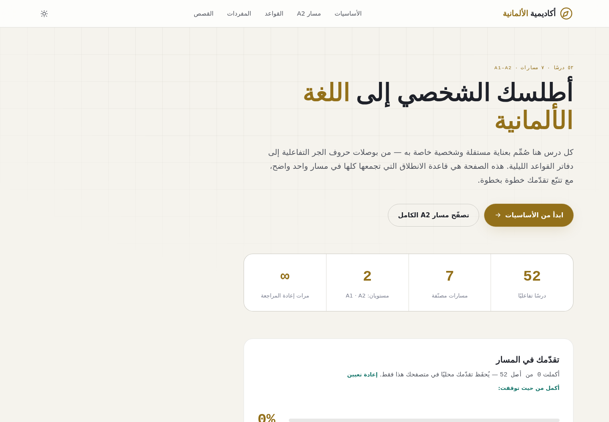
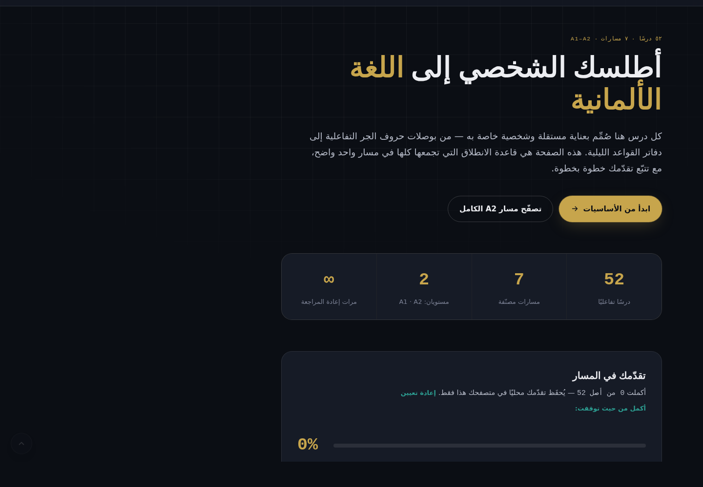
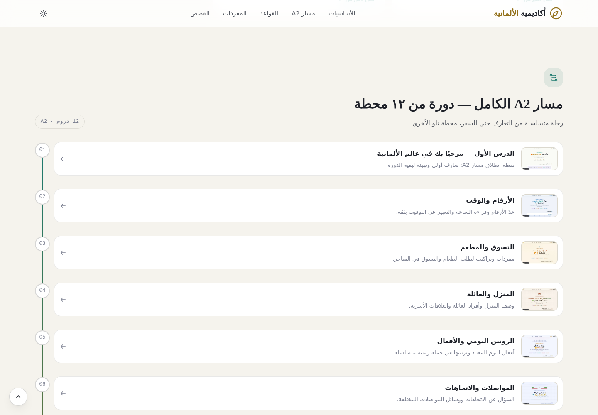
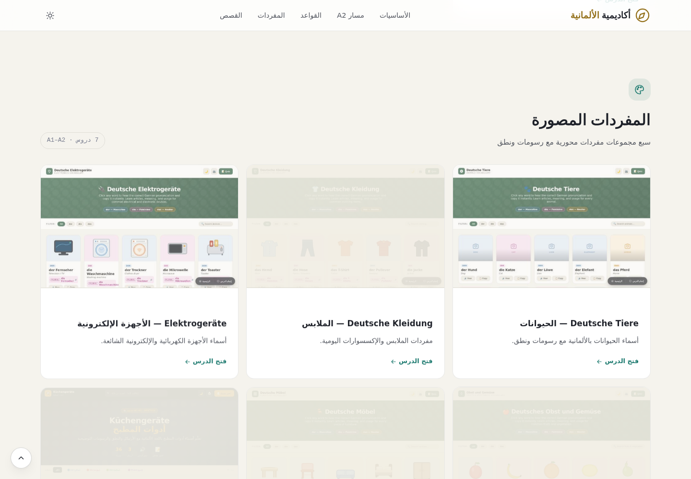
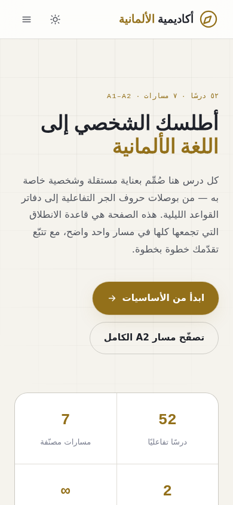
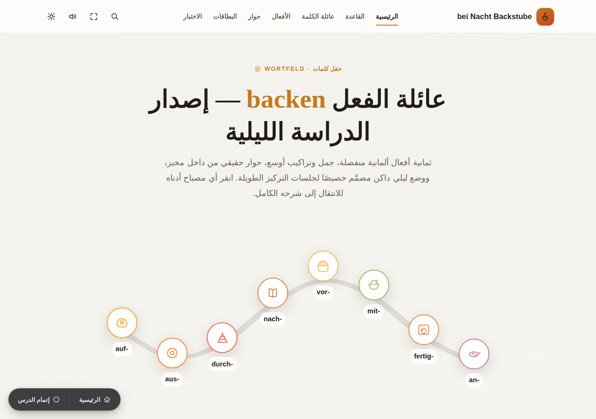

<div align="center">

# 🧭 أكاديمية الألمانية — Deutsch Akademie

### منصة موحّدة تربط ٦٣ درسًا تفاعليًا في اللغة الألمانية ضمن مسار تعليمي واحد

بحث فوري · فلاتر ذكية · تتبّع تقدّم محلي · وضع ليلي/نهاري كامل · بلا أي خطوة بناء (Build Step)

[](#)
[](#)
[](#)
[](#)
[](#)
[](#)
[](#)

</div>

---

## 📖 نظرة عامة

كل درس من الـ٦٣ درسًا في هذه المكتبة صُمِّم بشكل **مستقل تمامًا** — خطوطه وألوانه
وتفاعلاته الخاصة به. هذه المنصة لا تعيد تصميم تلك الدروس، بل تبنى فوقها
**"قاعدة انطلاق"** واحدة: تصنّفها، تجعلها قابلة للبحث، تتتبّع تقدّمك فيها،
وتربطها ببعضها برباط بصري خفيف لا يتصادم مع أي تصميم موجود.

<div align="center">


</div>

## ✨ أبرز الميزات

| الميزة | التفاصيل |
|---|---|
| 🖼️ **معاينة مصغّرة حقيقية** | لقطة فعلية من أعلى كل درس داخل بطاقته — لا أيقونة رمزية، بل شكل الدرس الحقيقي |
| 🔍 **بحث وفلاتر فورية** | بحث حي عبر عناوين ووصف كل الدروس، مع فلترة حسب القسم |
| 🗺️ **مسار A2 كخط زمني** | الدروس الـ١٢ المتسلسلة معروضة كمحطات مرقّمة ومترابطة، لا كبطاقات عشوائية |
| 📊 **تتبّع تقدّم حقيقي** | كل درس يُسجَّل تلقائيًا عند زيارته، ويمكن تحديده كمكتمل — يُحفَظ محليًا في متصفحك |
| ↩️ **أكمل من حيث توقفت** | رابط سريع لآخر درس زرته ولم تُكمله بعد |
| 🌗 **وضع ليلي/نهاري** | تبديل فوري بلا وميض عند التحميل، يحترم تفضيل نظامك تلقائيًا أول مرة |
| 🧩 **ربط غير متطفّل** | زر عائم صغير (عودة + إتمام) داخل كل درس، معزول بالكامل عبر Shadow DOM |
| 🗂️ **تنظيم بلا حذف** | كل الدروس الأصلية محفوظة كما هي، بأسماء ملفات نظيفة فقط |
| ♿ **إمكانية وصول** | تنقّل كامل بلوحة المفاتيح، تباين ألوان مريح، احترام `prefers-reduced-motion` |
| 🚀 **أداء عالٍ** | تحميل كسول (Lazy Load) لكل الصور، لا مكتبات خارجية، أيقونات SVG مضمّنة |

<div align="center">

</div>

## 🧱 التقنيات المستخدمة

هذا المشروع مبني عمدًا بتقنيات الويب الأساسية بلا أي إطار عمل (Framework) أو
أداة بناء (Bundler) — لأن كل درس مصدري هو أصلًا HTML/CSS/JS خام، فالحفاظ على
نفس العائلة التقنية عبر المشروع كله يعني: **صفر اعتماديات، نشر فوري بلا تثبيت،
وقابلية فتح مباشرة من أي متصفح أو استضافة ثابتة.**

- **HTML5 الدلالي** — عناصر `header` / `main` / `section` / `footer` بمعناها الصحيح
- **CSS3 حديث** — خصائص مخصّصة (Custom Properties) لنظام تصميم كامل، Grid وFlexbox، بلا أي إطار CSS خارجي
- **JavaScript خام (Vanilla ES6)** — بلا React أو أي مكتبة، لضمان أخف حمل ممكن
- **Shadow DOM** — لعزل العنصر العائم داخل كل درس عن تصميمه الأصلي عزلًا كاملًا
- **Web Storage API** (`localStorage`) — لتخزين تقدّم المستخدم محليًا دون خادم
- **IntersectionObserver** — لحركات الظهور عند التمرير بأداء عالٍ (بلا مستمعي scroll ثقيلين)
- **Google Fonts** — Markazi Text · IBM Plex Sans Arabic · IBM Plex Mono (مع خطوط احتياطية عند تعذّر التحميل)

## 📸 لقطات إضافية

<div align="center">

<br><br>


</div>

## 🎛️ التحكّم بالدروس المعروضة (إخفاء · حذف · إعادة ترتيب)

كل ما يظهر في الموقع — الدروس والأقسام وترتيبها — يُتحكَّم به من مكان واحد
فقط: **`assets/js/catalog.js`**. الملف نص عادي بصيغة JavaScript، معلَّق
بالكامل بالعربية، ويمكن تعديله بأي محرّر نصوص عادي (Notepad، TextEdit،
VS Code...) دون أي معرفة برمجية — فقط احفظ وأعد تحميل الصفحة.

### إخفاء أو حذف درس

ابحث عن الدرس داخل `lessons[]` وغيّر:

```js
"enabled": true,          // اجعلها false لإخفاء هذا الدرس من الموقع دون حذف ملفه
```

إلى `"enabled": false`. الدرس يختفي فورًا من كل مكان (الشبكة، المسار
الزمني، البحث، الإحصاءات) لكن **ملفه الأصلي يبقى محفوظًا على القرص** —
يمكنك إعادته بتغيير القيمة إلى `true` مرة أخرى في أي وقت. هذه الطريقة أأمن
من حذف الكتلة `{ ... }` بالكامل، لأنها لا تخاطر بكسر تنسيق الملف.

### إعادة ترتيب الدروس داخل قسمها

غيّر رقم `"order"` الخاص بالدرس — الرقم الأصغر يظهر أولًا:

```js
"order": 3,          // ترتيب هذا الدرس داخل قسمه — الأصغر يظهر أولًا
```

يمكنك استخدام أي أرقام، حتى الكسور مثل `2.5`، لإدراج درس بين درسين موجودين
دون الحاجة لإعادة ترقيم كل الدروس الأخرى في القسم.

### إخفاء قسم كامل، أو تغيير ترتيب الأقسام نفسها

نفس الفكرة تمامًا، لكن داخل `categories[]` في أعلى الملف بدل `lessons[]`.
تعطيل قسم (`"enabled": false`) يُخفي كل دروسه تلقائيًا معه دفعة واحدة.

### تغيير عنوان أو وصف درس

عدّل النص مباشرة بين علامتَي التنصيص أمام `"title"` أو `"desc"`.

> ⚠️ حقول عليها تعليق **"(لا تُغيّر)"** مثل `id` و`category` و`path` —
> تجاهلها؛ الموقع يعتمد عليها داخليًا لربط الدرس بملفه وصورته وتقدّمك
> المحفوظ. أما باقي الحقول (`title`, `order`, `enabled`, `desc`, `badges`)
> فآمنة تمامًا للتعديل المباشر.

## 🚀 التشغيل محليًا

لا حاجة لـ `npm install` ولا أي إعداد — المشروع بالكامل ملفات ثابتة.

**الطريقة الأسرع:** افتح `index.html` بالنقر المزدوج مباشرة في المتصفح.

**للحصول على كل الميزات دون قيود المتصفح على بروتوكول `file://`** (خصوصًا
`localStorage` في بعض المتصفحات)، شغّله عبر خادم محلي بسيط:

```bash
# داخل مجلد المشروع
python3 -m http.server 8080
# ثم افتح http://localhost:8080 في المتصفح
```

أو بأي بديل مشابه: إضافة **Live Server** في VS Code، أو `npx serve`.

## ☁️ النشر

اسحب المجلد بالكامل وأفلته في أي من هذه الاستضافات — بلا أي إعداد إضافي:

**Netlify** · **Vercel** · **GitHub Pages** · **Cloudflare Pages**

## 🗂️ هيكل المشروع

```
index.html                    الصفحة الرئيسية (المنصة/الفهرس)
assets/
  css/main.css                 نظام التصميم الكامل (فاتح/داكن، طباعة، تجاوب)
  js/theme-init.js              يمنع وميض السمة الخاطئة عند التحميل
  js/catalog.js                 فهرس كل الدروس — عدّله مباشرة لإخفاء/ترتيب الدروس (انظر القسم أعلاه)
  js/main.js                    منطق الصفحة الرئيسية بالكامل
  js/lesson-bridge.js            يُحقن في كل درس لربطه بالمنصة (عبر Shadow DOM)
docs/screenshots/               لقطات شاشة توثيقية (هذا الملف فقط)
Deutsch/
  a1/                            المرحلة A1 — نقطة الانطلاق (درسان)
  a2-kurs/                       مسار A2 الكامل — ١٢ درسًا متسلسلًا
  a2/                            أدلة A2 الشاملة (٦ أدلة عميقة)
  grammatik/                     مرجع القواعد الكامل (٢٢ مرجعًا)
  family-verben/                  عائلات الأفعال — إصدار الليل (٤ دروس)
  wortschatz/                     المفردات المصورة (٧ مجموعات)
  stories/                        قصص ومحادثات حقيقية (٤ دروس)
```

## 🔗 كيف تعمل آلية الربط؟

كل ملف داخل `Deutsch/` يحمل سطرًا واحدًا فقط أُضيف قبل `</body>`:

```html
<script src="../../assets/js/lesson-bridge.js"
        data-lesson-id="…" data-category="…" data-title="…" data-root="../../" defer></script>
```

هذا السكربت يرسم عنصرًا عائمًا صغيرًا داخل **Shadow Root** منفصل تمامًا —
فلا تصله أنماط الدرس المضيف، ولا تتسرّب أنماطه إليه. مسؤولياته فقط:
تسجيل الزيارة، زر العودة للرئيسية، وزر "تحديد كمكتمل". لا شيء آخر في تصميم
الدرس الأصلي يتغيّر.

الدروس تُفتح من الصفحة الرئيسية في **تبويب جديد** (`target="_blank"`)، حتى
تبقى الرئيسية بحالتها (بحثك، تصفّحك) دون أن تفقدها كلما فتحت درسًا.

## 🔒 الخصوصية والتقدّم

تقدّمك (الدروس المُكتملة والمُزارة) يُخزَّن **محليًا فقط** في متصفحك عبر
`localStorage` — لا يُرسَل إلى أي خادم، ولا يُشارَك بين متصفح وآخر أو جهاز
وآخر. يمكنك مسحه في أي وقت من زر "إعادة تعيين" أسفل شريط التقدّم.

## 🛣️ تحسينات مستقبلية مقترحة

- [ ] نطق صوتي موحّد لعناوين الدروس من الصفحة الرئيسية
- [ ] شهادة إتمام قابلة للتنزيل (PDF) عند الوصول إلى ١٠٠٪
- [ ] مزامنة اختيارية للتقدّم عبر الأجهزة (حاليًا محلي بتصميم متعمّد لحماية الخصوصية)
- [ ] وضع "مراجعة سريعة" يجمع الدروس غير المكتملة فقط في قائمة واحدة

---

<div align="center">
<sub>أكاديمية الألمانية — منصة تعليمية غير رسمية لتنظيم دروس شخصية · Deutsch Akademie · A1–A2</sub>
</div>
